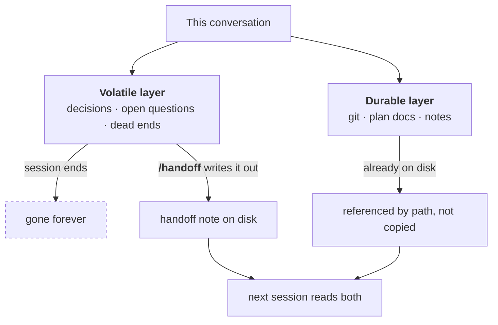
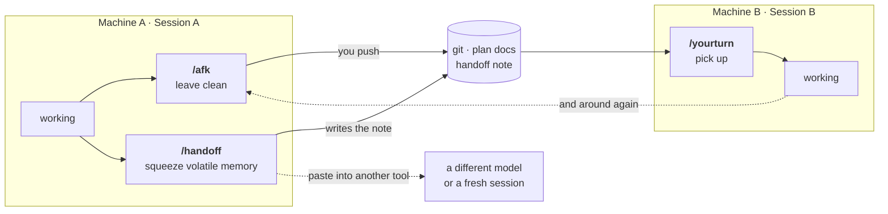

<!-- markdownlint-disable MD033 -->

# Relay Kit

**Three read-only rituals that keep context alive across machines, tools and sessions.**

[繁體中文](README.zh-TW.md)

Your agent session ends. The work does not. Relay Kit is the handover protocol for the gap in
between: leaving a machine clean, writing down what only exists in the conversation, and picking
it all back up somewhere else.

---

## The problem

Whoever picks up your work **cannot see your conversation**. They can only read the disk.

That splits everything you know into two layers, and only one of them survives:

| | Lives in | Survives the session? |
| :-- | :-- | :-- |
| **Durable** — commits, plans, READMEs, notes | The disk | Yes. Point at it, don't copy it. |
| **Volatile** — decisions you settled, questions still open, approaches you already proved don't work | The conversation only | **No. It evaporates.** |

Every painful handover is the same story: the volatile layer was lost, so the next session
re-litigated a settled decision, or walked back into a dead end you already mapped.

And the failure usually starts at the *departure* end, not the arrival end — work committed but
never pushed, a service still holding a port, a plan document that no longer matches the code.



---

## The three rituals

| Ritual | When | What it does |
| :-- | :-- | :-- |
| **`/afk`** | Before you walk away | Read-only sweep: unpushed commits, uncommitted work, services still up, plan docs that have drifted from the code. Reports; never acts on its own. |
| **`/handoff`** | Switching tool, model, or starting a fresh session | Squeezes the volatile layer out of the conversation into one self-starting note, with pointers to the durable layer. Redacted, and ready to paste anywhere. |
| **`/yourturn`** | When you sit back down | Syncs, then tells you what actually changed, where each project stands, what has gone stale, and what needs starting on *this* machine. |

Two supporting skills come along: **`/project-sync`** (safe sync + structure scan) and
**`/journal`** (a daily entry whose frontmatter `/yourturn` reads cheaply).



---

## Quick start

Requires Claude Code.

```bash
/plugin marketplace add unomae/relay-kit
/plugin install relay-kit@relay-kit
```

Then copy the config template into your repo and edit the tables:

```bash
mkdir -p .claude
curl -o .claude/relay.config.md https://raw.githubusercontent.com/unomae/relay-kit/main/templates/relay.config.md
```

Or just create `.claude/relay.config.md` by hand from
[`templates/relay.config.md`](templates/relay.config.md).

That is the whole setup. Plugin skills load at session start, so open a fresh session
first. Then try it:

```
/relay-kit:afk
```

The rituals work with no config at all. You get the git checks and nothing project-specific.
With the config, they can say *"the api's plan doc hasn't moved since you rewrote its retry
logic"*.

---

## Configuration

One file per repo, `.claude/relay.config.md`, with three tables. It is Markdown because
**agents read it the way you do**: there is no parser, so a malformed row degrades into
"not configured" instead of an error.

**Projects** — where does someone new start reading, and what proves the project still works?

| Project | First read | Verify command | Success evidence | Warnings |
| :-- | :-- | :-- | :-- | :-- |
| `api` | `api/README.md` | `pytest -q` | exit 0, `0 failed`, no skips | migrations hit shared staging |

`Success evidence` is the column people skip and then regret. Without it, *"I ran the tests"*
cannot be checked by anyone — including the next agent, which will happily believe itself.

**Services** — ports and start commands, so `/afk` can warn you they are still up and
`/yourturn` can tell the next machine what to start.

**Adapters** — optional checks, off by default. See below.

Machine-level values (a notes vault outside the repo, a fallback repo root, where `/handoff`
writes its notes) are set once at install time, via `/plugin` → Relay Kit → configure. They stay
out of the repo file: they are per-machine, and they do not belong in something your team shares.

---

## What it will never do

This is why you can run the rituals without reading the output first:

- Never `commit`, `push`, `stash`, `reset`, or discard a working-tree change
- Never resolve a conflict for you
- Never stop a running service, or delete anything
- Never overwrite uncommitted work

`/afk` and `/yourturn` **report**; you decide. Where a fix is obvious they offer it and wait for a
yes. The kit writes in exactly two places: `/handoff` creating its note, and `/journal` writing
the entry you just dictated.

If a check cannot run — a platform missing a command, a repo that will not answer — it is marked
**unverified** and the rest of the sweep continues. A check that fails must never be able to
report as a check that passed.

---

## Why each check exists

Every one of these came from a real failure:

| The check | The failure it came from |
| :-- | :-- |
| Committed-but-not-pushed, ranked above everything else | Arrived at the other machine, pulled, found nothing. The work had been committed the night before and never pushed. |
| Nested repo scan | A repo checked out inside the main one. The outer `git status` says clean, because it does not look in there. |
| Flattened symlink detection | A Windows checkout wrote tracked symlinks as plain text files. Nothing warned; the next commit broke them for everyone else. |
| "This pull changed the relay setup itself" | Instructions load *before* the pull. A pull that updates them leaves you running the old version — output looks perfectly normal and is quietly wrong. |
| Drift between code and its plan doc | The plan said one thing, the code said another, and the next session trusted the plan. |
| Queue-jam detection, ranked above open PRs | A finished item left in the queue made a fail-closed runner skip *every* subsequent night, silently. |
| "The query failed" reported loudly, never as "nothing found" | `timeout` does not exist on macOS by default. Command-not-found got swallowed by a redirect, an empty result printed as "all clear", and the check had been dead for days. |

That last row is the rule the whole kit is built on: **the dangerous output is not an error,
it is a clean report from a check that never ran.**

---

## Adapters

Optional checks, off by default, so that installing the kit does not hand you a screenful of
checks that can never fire in your setup. Turn one on in the config's Adapters table.

| Adapter | Adds |
| :-- | :-- |
| `nested-repos` | Scans git checkouts nested inside your repo |
| `symlink-repair` | Detects and offers to restore symlinks flattened by a Windows checkout |
| `hooks-path` | Ensures shared, versioned git hooks actually run on this machine |
| `mirror-skills` | Regenerates a second agent tool's mirror after pulling |
| `queue-check` | Reports scheduled-automation queue state and open PRs |
| `vault-journal` | Journals living outside the repo (Obsidian, cloud-synced folders) |

Each is documented in [`plugins/relay-kit/adapters/`](plugins/relay-kit/adapters/).

---

## Works with

- **Claude Code** — install as a plugin; skills are namespaced `/relay-kit:afk` and friends.
- **Any other agent tool** — `/handoff` emits a self-contained version of the note. Paste it into
  a different model, a fresh session, or a teammate's chat. No repo access required.
- **A human colleague** — the note is plain Markdown written for a reader who knows nothing about
  your session.

---

## Not a fit if

- You work on one machine, in one tool, and never lose a session. The rituals would be ceremony.
- You want something that automatically fixes what it finds. This kit deliberately stops at
  *telling you*.
- You need a full project-management layer. This is a handover protocol, not a tracker — it
  points at your plan documents rather than replacing them.

---

## Credits

Extracted from a working two-machine, multi-tool setup and generalized. The `/journal` question
set is adapted from a daily-journal skill by Raymond Hou.

MIT licensed — see [LICENSE](LICENSE).
