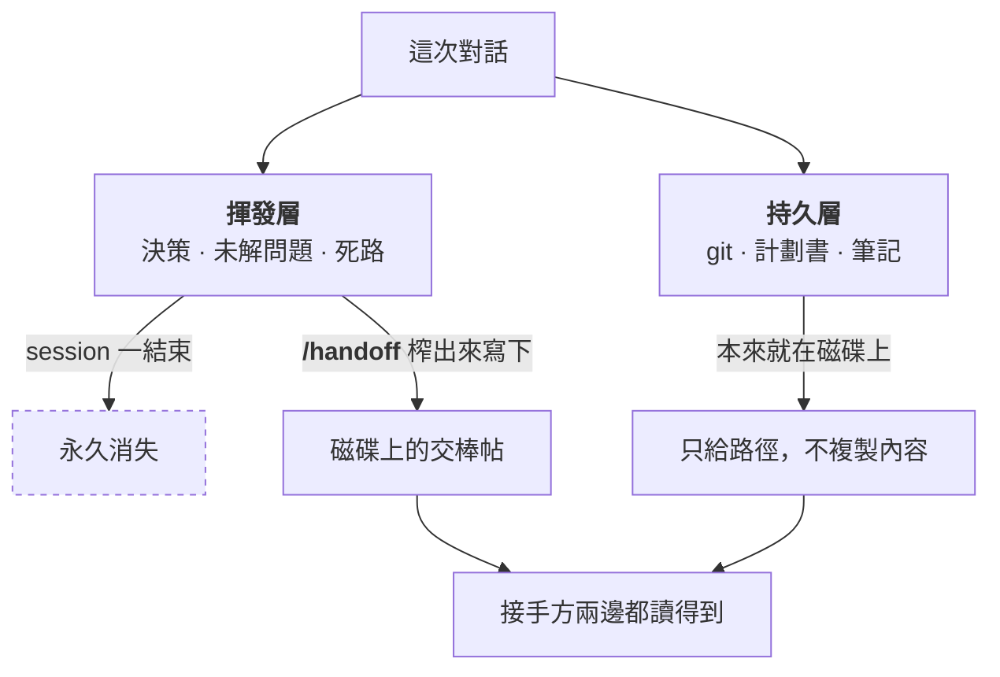
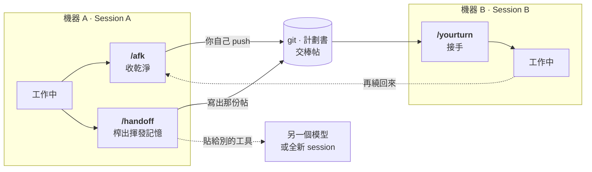

<!-- markdownlint-disable MD033 -->

# Relay Kit

**三個唯讀儀式，讓 context 在換機器、換工具、換 session 之間不斷線。**

[English](README.md)

Session 會結束，工作不會。Relay Kit 就是中間那段空白的交接協定——離機前收乾淨、把只活在對話裡
的東西寫下來、然後在另一頭接回去。

---

## 問題在哪

接手的人**看不到你的對話**，他只讀得到磁碟。

於是你知道的事被切成兩層，而且只有一層活得下來：

| | 活在哪 | 撐得過 session 結束嗎 |
| :-- | :-- | :-- |
| **持久層**——commit、計劃書、README、筆記 | 磁碟上 | 會。用指標指過去就好，不要複製。 |
| **揮發層**——已經拍板的決策、還沒解的問題、已經證明走不通的路 | 只在對話裡 | **不會，直接蒸發。** |

每一次痛苦的交接都是同一個故事：揮發層掉了，所以下一個 session 把定案的決策重翻一次，或是
一頭撞進你早就走過的死路。

而且問題通常不是發生在「到機」那端，是發生在**離機**那端——commit 了沒 push、服務還佔著 port、
計劃書早就跟 code 對不上了。



---

## 三個儀式

| 儀式 | 什麼時候用 | 做什麼 |
| :-- | :-- | :-- |
| **`/afk`** | 離開這台機器前 | 唯讀巡檢：未 push 的 commit、未 commit 的改動、還開著的服務、跟 code 對不上的計劃書。只回報，絕不自己動手。 |
| **`/handoff`** | 要換工具、換模型，或 context 太長要開新 session | 把揮發層從對話裡榨出來，寫成一份自啟動的交棒帖，加上持久層的指標，redact 過，貼哪都能跑。 |
| **`/yourturn`** | 回到座位上 | 先同步，再告訴你到底變了什麼、每個專案走到哪、哪些狀態過期了、這台機器要啟哪些服務。 |

另外附兩個配套 skill：**`/project-sync`**（安全同步 + 架構掃描）跟 **`/journal`**（日記，
frontmatter 讓 `/yourturn` 用極低成本讀到昨天發生什麼）。



---

## 快速開始

```bash
/plugin marketplace add unomae/relay-kit
/plugin install relay-kit@relay-kit
```

接著把設定範本複製進你的 repo，改成你自己的表：

```bash
mkdir -p .claude
curl -o .claude/relay.config.md https://raw.githubusercontent.com/unomae/relay-kit/main/templates/relay.config.md
```

或直接照 [`templates/relay.config.md`](templates/relay.config.md) 手動建一份
`.claude/relay.config.md`。

設定就這樣而已。試跑：

```
/relay-kit:afk
```

**完全不設定也能跑**，只是你只會拿到 git 層的檢查，沒有專案層的判斷。設定檔的價值在於讓儀式
講得出這種話：*「你重寫了 api 的 retry 邏輯，但它的計劃書從那之後沒動過。」*

---

## 設定檔

一個 repo 一份 `.claude/relay.config.md`，三張表。刻意用 Markdown，因為**agent 讀它的方式跟你
一樣**——沒有 parser，所以格式寫壞只會退化成「未設定」，不會噴錯。

**Projects**——新來的人從哪份文件開始讀？什麼指令能證明這專案還活著？

| Project | First read | Verify command | Success evidence | Warnings |
| :-- | :-- | :-- | :-- | :-- |
| `api` | `api/README.md` | `pytest -q` | exit 0、`0 failed`、無 skip | migration 會打到共用 staging |

`Success evidence` 這欄最多人跳過，然後最後悔。少了它，*「我跑過測試了」*這句話誰都驗不了——
包括下一個 agent，而它會很樂意相信自己。

**Services**——port 跟啟動指令。`/afk` 用它提醒你服務還開著，`/yourturn` 用它告訴下一台機器
要啟什麼。

**Adapters**——選配檢查，預設全關，見下面。

機器層級的值（放在 repo 外的筆記庫、fallback 的 repo 路徑、`/handoff` 交棒帖寫到哪）
在安裝時設一次
（`/plugin` → Relay Kit → configure），不寫進 repo 那份——那是每台機器各自的東西，不該塞進
團隊共用的檔案。

---

## 它永遠不會做的事

這段是讓你敢閉著眼睛跑這些儀式的原因：

- 絕不 `commit`、`push`、`stash`、`reset`，也不會丟掉工作區的改動
- 絕不幫你解 conflict
- 絕不關掉執行中的服務，也不刪任何東西
- 絕不覆蓋你還沒 commit 的工作

`/afk` 跟 `/yourturn` **只回報**，你決定。遇到明顯該修的它會問一句，等你點頭才動。整個 kit 唯一
的寫入是 `/handoff` 產出那份帖，以及 `/journal` 寫下你剛口述的日記。

檢查跑不動的時候——平台少了某個指令、某個 repo 不回應——一律標成**未確認**，其他檢查照跑。
**壞掉的檢查絕不能長得像通過的檢查。**

---

## 每個檢查為什麼存在

下面每一條都是真的踩過，不是假想：

| 檢查 | 來自哪次事故 |
| :-- | :-- |
| 「已 commit 未 push」排在所有項目最前面 | 到了另一台機器，pull 下來什麼都沒有。東西前一晚就 commit 了，從沒 push。 |
| Nested repo 掃描 | 主 repo 裡面藏了另一個 repo。外層 `git status` 說乾淨，因為它根本不會看進去。 |
| 偵測被壓平的 symlink | Windows checkout 把版控裡的 symlink 寫成純文字檔。沒有任何警告，下一次 commit 就替所有人弄壞它。 |
| 「這次 pull 改到了 relay 自己」 | 指令是在 pull **之前**載入的。這次 pull 如果更新了它自己，你跑的還是舊版——輸出看起來完全正常，而且是錯的。 |
| Code 與計劃書的漂移 | 計劃書說一套、code 說另一套，然後下一個 session 相信了計劃書。 |
| 佇列卡死優先於待審 PR | 做完的項目留在佇列沒銷帳，fail-closed 的排程器於是**每一晚**都跳過施工，全程無聲。 |
| 「查詢失敗」要大聲講，絕不能印成「沒有東西」 | macOS 預設沒有 `timeout`，command not found 被重導吃掉，空結果印成「一切正常」，那個檢查其實已經死了好幾天。 |

最後一條就是整個設計哲學：**真正危險的輸出不是錯誤訊息，是一份「根本沒跑過的檢查」交出來的
乾淨報告。**

---

## Adapters（選配檢查）

預設全關，免得別人裝完滿螢幕都是他環境裡永遠不會觸發的檢查。要開就在設定檔的 Adapters 表打開。

| Adapter | 加了什麼 |
| :-- | :-- |
| `nested-repos` | 掃 repo 裡面嵌套的其他 git checkout |
| `symlink-repair` | 偵測被 Windows checkout 壓平的 symlink，並提議還原 |
| `hooks-path` | 確保版控裡的共用 git hook 在這台機器真的有生效 |
| `mirror-skills` | pull 完把 skills 重新鏡像給第二個 agent 工具 |
| `queue-check` | 回報排程自動化的佇列狀態與待審 PR |
| `vault-journal` | 日記放在 repo 外（Obsidian、雲端同步資料夾） |

各自的說明在 [`plugins/relay-kit/adapters/`](plugins/relay-kit/adapters/)。

---

## 可以搭什麼用

- **Claude Code**——裝成 plugin，skill 會加上命名空間：`/relay-kit:afk` 等等。
- **任何其他 agent 工具**——`/handoff` 會另外產一份自帶內容的版本，貼給別的模型、新 session、
  或同事的聊天室都能直接冷啟，不需要對方存取得到你的 repo。
- **人類同事**——那份帖就是純 Markdown，寫給「完全不知道你這 session 發生什麼事」的讀者看的。

---

## 這些情況不適合

- 你只用一台機器、一個工具，而且從不掉 session。那這三個儀式只是多餘的儀式感。
- 你想要一個「發現問題就自動修好」的工具。這個 kit 刻意停在**告訴你**這一步。
- 你需要完整的專案管理層。這是交接協定不是追蹤系統——它指向你的計劃書，不取代它。

---

## 出處

從一套實際在用的雙機、多工具環境抽出來通用化。`/journal` 的問題設計改編自 Raymond Hou 的
每日日記 skill。

MIT 授權，見 [LICENSE](LICENSE)。
