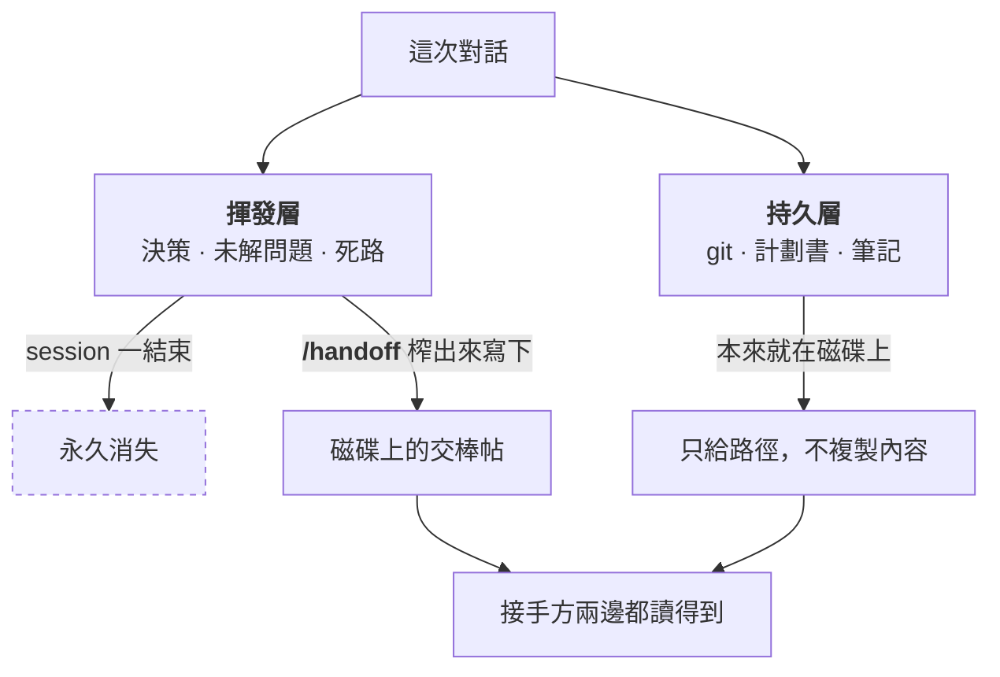
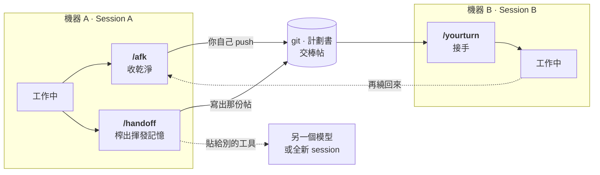
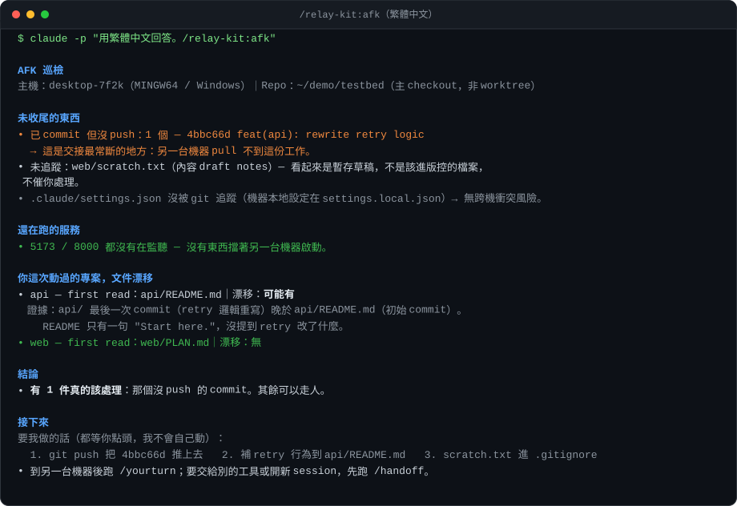

<!-- markdownlint-disable MD033 -->

# Relay Kit

**三個唯讀儀式，讓 context 在每次換機器、換工具、換 session 之間不斷線。**

[English](README.md)

Session 會結束，工作不會。中間那段空白，就是 Relay Kit 想要補的洞——離開電腦前收乾淨、把只活在對話
裡的東西寫下來、然後等你回來繼續在另外一台電腦做的時候接得回去。

工作、家裡電腦兩邊跑的時候非常適合。

---

## 問題在哪

一言以蔽之：**接手的人看不到你的對話，他只讀得到空氣。**

這句話聽起來像廢話，你這個 session 累積的東西，一關上就沒了，而且只有
一半活得下來：

| | 活在哪 | 撐得過 session 結束嗎 |
| :-- | :-- | :-- |
| **持久層**——commit、計劃書、README、筆記 | 磁碟上 | 會。用指標指過去就好，不要複製。 |
| **揮發層**——已經拍板的決策、還沒解的問題、已經證明走不通的路 | 只在對話裡 | **不會，直接蒸發。** |

每一次痛苦的交接，前篇一律：揮發層掉了，於是下一個 session 把定案的決策重吵一次，或者
一頭撞進你早就走過、也早就知道走不通的那條死路。

那漏的是哪一端呢？你可能會想說是「換了工作/電腦」pull 了但沒接好。其實不是，**通常在離開電腦那端就已經漏了**
——commit 了沒 push、服務還佔著 port、計劃書早就跟 code 對不上。而等你發現的時候，人已經坐在
另一台電腦從頭來過。



---

## 三個儀式

三個儀式對應三個時間點：走之前、換工具的時候、坐回來之後。

| 儀式 | 什麼時候用 | 做什麼 |
| :-- | :-- | :-- |
| **`/afk`** | 離開這台機器前 | 唯讀巡檢：哪些 commit 還沒 push、哪些改動還沒 commit、哪個服務還開著、哪份計劃書已經跟 code 對不上。它只講，不動手。 |
| **`/handoff`** | 要換工具、換模型，或 context 長到該開新 session 了 | 把揮發層從對話裡榨出來，寫成一份「對方冷啟也讀得懂」的帖。敏感資訊會先遮掉，持久層只給路徑不整段複製，貼到哪裡都能跑。 |
| **`/yourturn`** | 坐回來的時候 | 先同步，再告訴你：到底變了什麼、每個專案走到哪、哪些狀態已經過期、這台機器還有什麼沒啟動。 |

另外附兩個配套 skill：**`/project-sync`**（安全同步 + 架構掃描）跟 **`/journal`**（每天一篇
日記，它的 frontmatter 讓 `/yourturn` 用很低的成本就知道你昨天在幹嘛）。



---

## 實際印出來長這樣

講這麼多，不如直接看它吐什麼出來。下面是在一個 demo repo 實跑 `/afk` 的結果——那個 repo 裡有
一個 commit 沒 push，還有一個沒收乾淨的暫存檔：



---

## 快速開始

需要 Claude Code。

```bash
/plugin marketplace add unomae/relay-kit
/plugin install relay-kit@relay-kit
```

接著把設定範本複製進你的 repo，再改成你自己的表：

```bash
mkdir -p .claude
curl -o .claude/relay.config.md https://raw.githubusercontent.com/unomae/relay-kit/main/templates/relay.config.md
```

或者直接照 [`templates/relay.config.md`](templates/relay.config.md) 手動建一份
`.claude/relay.config.md`，一樣。

設定就這樣，沒有第二步。唯一要注意的是：plugin 的 skill 是 session 啟動時載入的，所以你得先
開一個新 session，才叫得動它。然後試跑：

```
/relay-kit:afk
```

**完全不設定也能跑**，只是這樣拿到的只有 git 那層的檢查，沒有專案層的判斷。設定檔的價值在於
讓儀式講得出這種話：*「你重寫了 api 的 retry 邏輯，但它的計劃書從那之後就沒動過。」*

---

## 設定檔

一個 repo 一份 `.claude/relay.config.md`，裡面三張表。

你可能會想說：設定檔為什麼用 Markdown，不用 YAML 或 JSON？因為 **agent 讀它的方式跟你一樣**，
沒有 parser 這回事。所以格式寫壞了，最糟也只是退化成「這欄沒設定」，而不是整份噴錯、讓儀式
直接跑不動。

**Projects**——新來的人該從哪份文件開始讀？哪一行指令能證明這個專案還是活的？

| Project | First read | Verify command | Success evidence | Warnings |
| :-- | :-- | :-- | :-- | :-- |
| `api` | `api/README.md` | `pytest -q` | exit 0、`0 failed`、無 skip | migration 會打到共用 staging |

`Success evidence` 是最多人跳過、然後最後悔的一欄。少了它，*「我跑過測試了」*這句話沒有人驗得
了——包括下一個 agent，而它會非常樂意相信自己。

**Services**——port 跟啟動指令。`/afk` 靠它提醒你服務還開著，`/yourturn` 靠它告訴下一台機器
該啟什麼。

**Adapters**——選配的檢查，預設全關，下面會講。

還有一種值是跟著機器走、不是跟著 repo 走的：放在 repo 外面的筆記庫、找不到 repo 時的 fallback
路徑、`/handoff` 要把帖寫到哪。這些在安裝時設一次就好：`/plugin` → Relay Kit → configure。
它們不寫進 repo 那份設定檔，因為那是你這台機器自己的事，不該塞進團隊共用的檔案裡。

---

## 它永遠不會做的事

這一段是你敢閉著眼睛跑這些儀式的理由：

- 絕不 `commit`、`push`、`stash`、`reset`，也不會動你工作區裡的任何改動
- 絕不幫你解 conflict
- 絕不關掉正在跑的服務，也不刪任何東西
- 絕不覆蓋你還沒 commit 的工作

`/afk` 跟 `/yourturn` **只回報，你決定**。遇到明顯該修的，它會問你一句，等你點頭才動。整個 kit
只有兩個地方會寫檔：`/handoff` 產出那份帖，還有 `/journal` 寫下你剛剛口述的日記。

那如果檢查本身跑不動呢——平台上根本沒有那個指令、某個 repo 不回話？這種一律標成**未確認**，
其他檢查照跑；一個檢查掛掉，不可以把整份巡檢一起拖下水。原則就一句：**壞掉的檢查，絕對不能
長得像通過的檢查。**

---

## 每個檢查為什麼存在

下面每一條都不是想像出來的，是真的踩過：

| 檢查 | 來自哪次事故 |
| :-- | :-- |
| 「已 commit 未 push」排在所有項目最前面 | 到了另一台機器，pull 下來，什麼都沒有。東西前一晚就 commit 了，只是從來沒 push。 |
| Nested repo 掃描 | 主 repo 裡面還藏了另一個 repo。外層 `git status` 說一切乾淨——它本來就不會看進去。 |
| 偵測被壓平的 symlink | Windows checkout 把版控裡的 symlink 寫成了普通文字檔。全程沒有任何警告，下一次 commit 就替所有人弄壞它。 |
| 「這次 pull 改到了 relay 自己」 | 指令是在 pull **之前**就載入的。所以這次 pull 如果更新了它自己，你跑的還是舊版——輸出看起來完全正常，而且是錯的。 |
| code 跟計劃書的漂移 | 計劃書說一套、code 說另一套，然後下一個 session 相信了計劃書。 |
| 佇列卡死排在待審 PR 前面 | 一個做完卻沒銷帳的項目卡在佇列裡，fail-closed 的排程器於是**每一晚**都直接跳過施工，全程無聲。 |
| 「查詢失敗」要大聲講，不准印成「沒有東西」 | macOS 預設沒有 `timeout` 這個指令，command not found 被重導吃掉，空結果印成「一切正常」。那個檢查其實已經死了好幾天。 |

最後一條就是整個 kit 的地基，也是這份 README 最希望你記住的一句話：**真正危險的輸出從來不是
錯誤訊息，而是一份根本沒跑過的檢查，交出來的一張乾淨報告。**

---

## Adapters（選配檢查）

為什麼要做成選配？因為裝完就塞你一整螢幕的檢查，其中大半在你的環境裡永遠不可能觸發，那你很快
就會學會跳過整份輸出——到那時候，所有檢查就一起失效了。所以預設全關，要哪個就去設定檔的
Adapters 表打開哪個。

| Adapter | 加了什麼 |
| :-- | :-- |
| `nested-repos` | 掃 repo 裡面嵌套的其他 git checkout |
| `symlink-repair` | 偵測被 Windows checkout 壓平的 symlink，並提議還原 |
| `hooks-path` | 確認版控裡的共用 git hook 在這台機器真的有生效 |
| `mirror-skills` | pull 完之後，把 skills 重新鏡像給第二個 agent 工具 |
| `queue-check` | 回報排程自動化的佇列狀態，還有待審的 PR |
| `vault-journal` | 日記放在 repo 外面（Obsidian、雲端同步資料夾那種） |

各自的說明在 [`plugins/relay-kit/adapters/`](plugins/relay-kit/adapters/)。

---

## 可以搭什麼用

- **Claude Code**——裝成 plugin，skill 會帶命名空間：`/relay-kit:afk`，其他兩個依此類推。
- **任何其他 agent 工具**——`/handoff` 會另外產一份自帶內容的版本。貼給別的模型、貼進全新的
  session、貼到同事的聊天室都行，對方碰不到你的 repo 也沒關係。
- **人類同事**——那份帖就是純 Markdown，而且是寫給「完全不知道你這個 session 發生過什麼」的
  人看的。

---

## 這些情況不適合

- 你只用一台機器、一個工具，而且從來不掉 session。那這三個儀式對你來說就只是儀式感。
- 你想要的是「發現問題就順手修好」的工具。這個 kit 刻意停在**告訴你**這一步，不會再往前一步。
- 你需要一整套專案管理層。這是交接協定，不是追蹤系統——它指向你的計劃書，不打算取代它。

---

## 想貢獻

最有價值的貢獻是一個新的 adapter：一個只有你那種環境才會觸發、多數人根本用不到的檢查。
怎麼做見 [CONTRIBUTING.md](CONTRIBUTING.md)。

---

## 出處

從一套實際在用的雙機、多工具環境裡抽出來，再通用化。`/journal` 的問題設計改編自 Raymond Hou
的每日日記 skill。

MIT 授權，見 [LICENSE](LICENSE)。
